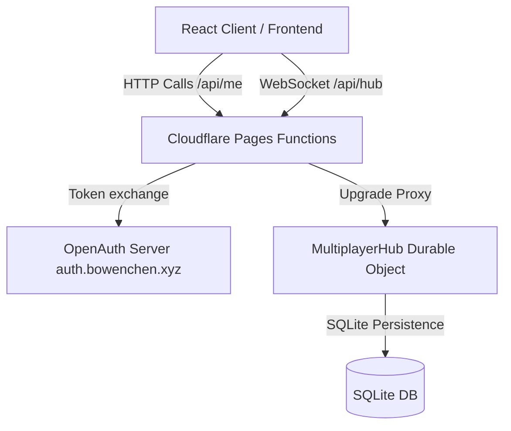

# Bowen Cloud Services (BCS) Terminal

A dashboard console application for Bowen Cloud Services (BCS). This project integrates real-time telemetry feeds, client geolocation tracking, and a persistent multi-user chat console utilizing serverless backend architecture.

## Features

* **Telemetry Integration**: Real-time periodic data fetching of external APIs, including USGS earthquake data, International Space Station (ISS) satellite coordinates, and client node parameters.
* **WebSocket Gateway**: Persistent full-duplex communication channel using Cloudflare Durable Objects.
* **SQLite Persistence**: Messages and client username mappings are stored and retrieved using the Durable Object SQLite Storage API.
* **OpenAuth Authentication**: Session validation using a self-hosted OpenAuth server mapped to the custom domain `auth.bowenchen.xyz`.
* **Durable Session Self-Healing**: Serverless session verification checks and automatic token rotation handled via secure HTTP-Only cookies.

## Technology Stack

* **Frontend**: React, Vite, Tailwind CSS, Vanilla CSS
* **Backend**: Cloudflare Pages Functions (Serverless edge routes)
* **Real-time State**: Cloudflare Durable Objects (SQLite Storage API)
* **Authentication**: OpenAuth Client (`auth.bowenchen.xyz`)

---

## Architecture



### 1. Frontend Client
* Source code located in `src/`. Entry point: `src/main.jsx`.
* Main application layout: `src/components/Dashboard.jsx`.
* Geolocation, ISS tracking, and WebSocket handlers: `src/components/TelemetryContext.jsx`.
* Chat console state and messaging forms: `src/components/ChatConsole.jsx`.

### 2. Pages Functions (Backend)
* Edge router endpoints located in `functions/api/`.
* `callback.js`: Exchanges authentication codes and sets HTTP-Only tokens (`bcs_access_token`, `bcs_refresh_token`).
* `me.js`: Evaluates active session cookies, issues refreshes using OpenAuth client verification, and sets cache-prevention headers.
* `hub.js`: Validates cookies on WebSocket upgrade requests and proxies connection streams to the Durable Object.

### 3. Durable Object Hub
* Source code located in `bcs-do-worker/`.
* Handles SQL transactions for storing up to 50 active message logs.
* Broadcasts chat notifications and presence states to active WebSocket client endpoints.

---

## Local Development

1. **Install dependencies** in the root and in the sub-directories:
   ```bash
   npm install
   cd bcs-do-worker && npm install
   cd ../bcs-auth-server && npm install
   ```

2. **Run all environments concurrently**:
   ```bash
   npm run dev:all
   ```
   This command starts the local frontend development server, auth server, Durable Object emulator, and Pages worker proxy.

---

## Deployment

The application frontend and serverless Functions are deployed to Cloudflare Pages:
```bash
npx wrangler pages deploy dist --project-name=bcs --branch=main --commit-dirty=true
```
The MultiplayerHub Durable Object is deployed as an independent Worker script.
