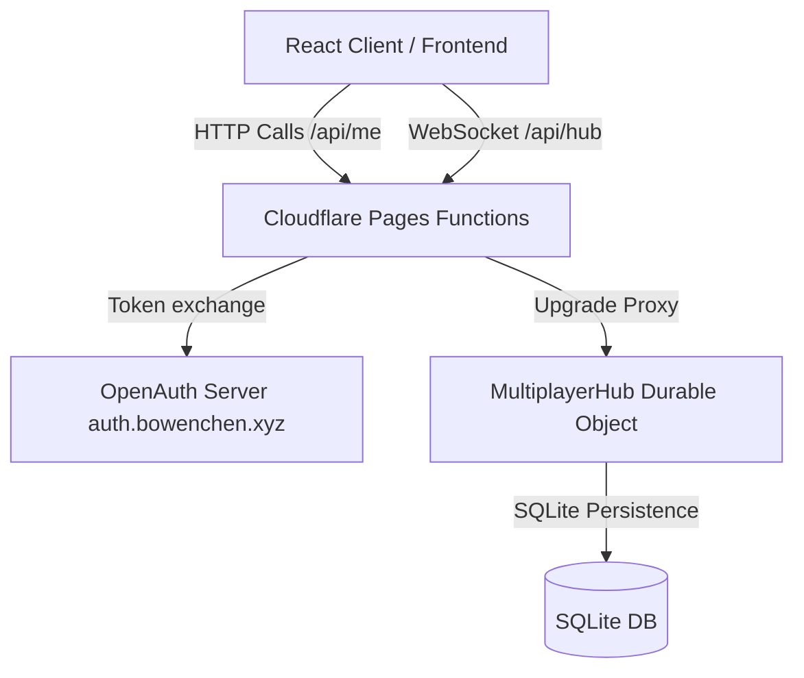

# Bowen Cloud Services (BCS) Terminal

A premium, high-fidelity dashboard console designed for Bowen Cloud Services (BCS). It features a monospace hacker aesthetic with matrix rain animations, live telemetry feeds, real-time system resource tracking, and a durable global live chat console.

## 🚀 Features

* **Terminal UI Aesthetic**: Pure green-phosphor glow styling with interactive CRT scanline overlays and dynamic matrix code rain.
* **Telemetry Data Integration**: Real-time integration of live feeds including earthquake tracking (USGS), International Space Station (ISS) geolocation, and IP/node details.
* **Durable Global Chat**: Secure multi-client communication using WebSockets backed by a Cloudflare Durable Object SQLite database.
* **Authentication**: Seamless passwordless authentication powered by OpenAuth (custom domain at `auth.bowenchen.xyz`).
* **HTTP-Only Token Rotation**: Secure session management via auto-refreshing cookies that remain durable across token expirations without client-side JS exposure.

## 🛠 Technology Stack

* **Frontend**: React, Vite, Tailwind CSS, Vanilla CSS
* **Runtime**: Cloudflare Pages Functions (Serverless handlers)
* **Real-time State**: Cloudflare Durable Objects (SQLite Storage API)
* **Auth Issuer**: OpenAuth (`auth.bowenchen.xyz`)
* **Styling**: Cyberpunk-inspired monospace styling with custom fonts and glows

---

## 📐 Architecture



### 1. Frontend Client
* Located in `src/`. Entry point is `src/main.jsx`.
* Main application layout in `src/components/Dashboard.jsx`.
* WebSocket connection manager & telemetry streams in `src/components/TelemetryContext.jsx`.
* Communication terminal UI in `src/components/ChatConsole.jsx`.

### 2. Pages Functions (Backend)
* Handled by Cloudflare Pages serverless endpoints in `functions/api/`.
* `callback.js`: Manages code exchange and initial HTTP-only cookie setting.
* `me.js`: Verifies sessions and swaps expired tokens using refresh tokens. Includes cache-busting headers to prevent browser-level session caching.
* `hub.js`: Authorizes WebSocket upgrade connections and routes them to the MultiplayerHub Durable Object.

### 3. Durable Object Hub
* Located in `bcs-do-worker/`.
* Operates under Workers D1/SQLite integration to persist messages and secure client usernames.
* Manages multi-client WebSocket broadcasting.

---

## 💻 Local Development

1. **Install dependencies** in the root and in the sub-directories:
   ```bash
   npm install
   cd bcs-do-worker && npm install
   cd ../bcs-auth-server && npm install
   ```

2. **Run all environments concurrently**:
   ```bash
   npm run dev:all
   ```
   This will simultaneously start the frontend Vite app, the local Auth server, the Durable Object emulator, and the Pages worker proxy.

---

## 🌎 Deployment

The frontend application and its serverless functions are deployed to **Cloudflare Pages**:
```bash
npx wrangler pages deploy dist --project-name=bcs --branch=main --commit-dirty=true
```
The MultiplayerHub Durable Object is hosted as a separate worker binding in Cloudflare.
